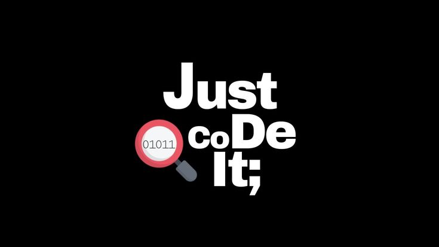

# 🌟 Welcome to my GitHub Profile! 🌟

  

## 👋 Who am I?  
Passionate about programming, I explore various languages and technologies. Here's an overview of what I know:

### 💻 Programming Languages:
- Java ☕  
- C / C++ 🔵  
- C# 🎮  
- Python 🐍  
- HTML / CSS / JavaScript 🌐  
- NodeJS ⚡  
- React ⚛️  

### 🗄️ Databases:
- MySQL 🐬  
- PostgreSQL 🐘  
- Microsoft Access 📊  

### 🧮 Mathematical Tools & Software:
- Gnuplot 📈  
- Maxima ∑  
- LaTeX ✍️  

### 🔧 Development Environments:
- VS Code 🖥️ (mainly)  
- Visual Studio 🎨 (a little)  

## 📫 Contact Me:
You can find me here:  
- 💼 [LinkedIn](#)  
- 📧 [Email](#)  

Thanks for stopping by, and happy coding! 🚀  
